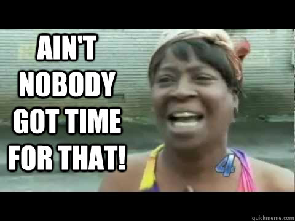

# Spotify Recorder

I love Spotify. I first subscribed around the time I was in college, and it has helped me to discover so many songs that I now love. However, over time I found that I wasn't really listening to new music, but continued to listen to the same songs I knew I enjoyed (I'm most certainly a creature of habit). The money going into Spotify each month didn't really feel worth it, but if I didn't subscribe, I wouldn't be able to download and listen to my perfectly crafted playlists in whatever order I want...

Or could I?

 

## Idea Time

I started investigating ways that I could get all of my songs from Spotify and onto my local computer. My first thought was to record every song from every playlist with a tool like Audacity as the song was playing. That idea was dismissed very quickly, since that would take days of manually recording each song. No way!

My next thought was to try and get the songs from YouTube. There are several online tools that convert YouTube videos into MP3s, as well as the wonderful [4K Video Downloader](https://www.4kdownload.com/products/product-videodownloader). None of those would allow me to do this in a quick and automated way, though (unless I wanted to pay for the downloader).

I thought that surely there must be something these tools are using that I could repurpose. Lo and behold, I stumbled across [youtube-dl](https://github.com/ytdl-org/youtube-dl/), a command-line tool that allows you to download YouTube videos. It appears that this tool is pretty common knowledge, but I had never heard of it before. I was ecstatic, and it seemed like I actually had the beginnings of a plan.

 

## The Plan: #1

I got myself a copy of youtube-dl, looked through a bit of documentation and did some DuckDuckGo searches to figure out how to use the tool, and then wrote a quick test Python program to take a URL and pass it along to youtube-dl to download the song from YouTube. Once I confirmed the results, I started looking into the Spotify API to see how I could get a list of songs for each playlist I was interested in. Messing around with the Console on the Spotify Developer page, I found the API endpoint I needed, generated an API token, and pulled down the track list for each playlist.

Now, the Spotify API has a way for you to setup an application to permanently connect with the API so that you don't have to keep getting a new token all the time. Honestly, I was lazy and chose to just copy the token generated by the online Console and using it in my code. This seemed acceptable since I would only need to access the Spotify API once to get the playlist data.

I wrote a quick program to go through each playlist file and spit out a single one that removed any duplicate songs that were shared between playlists. This file had several pieces of information for each track: name, artist, album, year, art url, etc. I needed a way to take this data and search for the appropriate song on YouTube.

I first considered trying to scrape YouTube's page whenever creating a manual browser search, but decided this would be foolish and take too much effort. Next, I started to investigate the YouTube API. I created an app, got the keys for it, and began making search requests using the name, artist, and album as parameters in the search. This gave varying results: popular songs like You Shook Me All Night Long by AC/DC came up as the first result with this method, but less well-known songs (most of the songs in my Chillstep playlist) did not have accurate results for the first match in the YouTube search.

I could write something that looked through each of the search results, but I was trying to be cautious and preserver the number of request "units" I had. The YouTube API uses units to determine the cost of making certain actions. Search requests use up quite a few of the daily units your app is allotted, and the number increases with the number of results you want back from your query.

I ended up settling on limiting myself to 3 results for each song query, and then I would get each video's number of views and pick the one with the highest. With the URL of the chosen video, I could then pass that to youtube-dl and grab the song.

Once all that was written up, it was time for the first real test. I started the program and let it run. It finished pretty quickly, since the program consumed all of my YouTube API units for the day. It managed to pull 100-200 songs before finishing. This was definitely a step in the right direction, but I wanted this to go faster, otherwise it would take weeks to get all of the songs.

I started looking around to see how I could reduce the number of units I was using, when I noticed that my Google account allowed me to create more than one YouTube API app. So, I created the maximum number of free apps on my account, and then did the same thing with my other two Google accounts. I grabbed all of their API keys, chucked them into my existing code and looped over all of them, moving to the next as each was used up. With this in place, I was able to get well over half of the songs downloaded, leaving only one more day to get the rest!

The total download time took around 30 minutes if I remember correctly, so this approach was very time efficient. But, how did the results stand up?

While the process was running, I inspected the results I got, and found them to be...lacking. I encountered a couple of problems:
* Some songs were completely wrong. For some songs, including the album title in the search query gave worse results than just the name and artist. For lots of other songs, it just completely failed to get any good results. These were more obscure songs, such as classical music.
* Many songs did not sound that great. youtube-dl downloads at 124kb quality, and YouTube videos are already compressed and the original sources they were uploaded from may have been lossy, so overall the quality was suffering. For a comparison, Spotify's Very High Quality setting for Premium members plays at 320kb quality.

I needed a new approach, but what?

 

## The Plan: #2

How could I get better quality recordings, and also ensure that the songs were correct? I didn't see any other way than to record straight from the source, Spotify itself. Of course, I didn't want to do this manually, though. I needed to come up with some sort of automated method.

To do this, I needed some sort of command-line based tool that could control Spotify, something I could trigger programmatically. There were several to choose from, but I ended up settling on [baton](https://github.com/joshuathompson/baton). This nice tool allowed me to directly control my Spotify desktop client and play a song with a search query.

Next, I needed something to record desktop audio. FFmpeg was the obvious choice for this job. I decided I would record the songs to .flac files first to preserve as much quality as possible, and then later convert to .mp3 when I was ready to move the songs to a device.

With these two pieces I put together a program that went through the same file of tracks and queried baton with the name, artist, and album as before. Once the baton command was triggered, FFmpeg was used to immediately start recording for the duration of the song. This process took several days to complete, so I let it run constantly. I didn't use my Spotify account with my phone so as not to interrupt the recordings, and I prayed that the OS would not make any sort of notification sounds while recording.

When it finished about a week later, I looked at the results. They were *much* better than the YouTube results. However, there were still problems:
* Many songs had no sound at all. For these, baton had failed to find a match with the search query, so no song was started and FFmpeg ended up recording silence for the duration of the song.
* Many songs had timing issues. Most of the issues were at the beginning of the song, since there was a bit of delay between calling baton and it starting playback on Spotify. During this delay, FFmpeg would be recording and counting the silence towards the total duration of the song. This resulted in the song being cut short at the end. There were also several songs where the beginning of the song started off with a completely different song because baton had failed to pause the previous playback in time before the next recording started.

I became discourage after this. An entire week of recording, but many of the songs were failures (there were more good recordings than bad, but I wanted something seamless). I ended up putting down the project around January 2020 and let it rest for several months before I came back to it in September 2020.

 

## The Plan: #3

I started looking into the project again, determined this time to find a solution. My main problems had been timing issues, and failing to find the song when searching with baton. I realized that both of these issues could be mitigated by reducing the amount I was using baton.

Instead of using baton to search for each song, why not just use baton to trigger playback of an entire playlist? Then, simply record the entire playlist with FFmpeg, and later break it up into individual files based on each song's duration. This seemed like a good solution, but then I realized that there could be many duplicates that would end up being recorded, wasting precious time (I have several playlists that share songs, so this would have been a big problem for me).

It seemed I would still need a way to trigger individual songs. But, I couldn't depend on baton's search to find each song. What to do? Well, I came across [this issue](https://github.com/spotify/web-api/issues/675), where I finally found my answer. In one of the comments, it is mentioned that the API does not support playing an individual track, but you can pass an array of track URIs to the API.

I took this information and decided to fork baton and start making a custom command, one that would allow me to pass one or more track URIs to baton that it would send to Spotify to play. The forked repo can be found [here](https://github.com/firstlane/baton). After making the needed change, I started calling my new command with each individual track URI wrapped in an array, and each song was being triggered perfectly. And, the delay in starting the song was significantly reduced since baton did not need to search for a matching song anymore. Things were starting to look up!

I modified the code to use this new command in baton, and setup FFmpeg to record a little longer than the actual duration of the song just in case there was a delay in starting the song. I ran [IsWindowsPlayingSound](https://github.com/smourier/IsWindowsPlayingSound) in a separate thread to mark the time when playback actually started, and then used this to determine how much time to trim from the beginning and end of the recording to get the final song output.

I let this code run for another week, and the results were...

Much, much better.

The vast majority of the songs were recorder pretty much perfectly. Some of them have a blip at the beginning of the song, which was being caused by the next song in the Spotify queue starting before being paused by baton, but this issue was fixed early on in the recording process, so a limited number of tracks were affected by it and can always be recorded later.

Overall, this approach worked out very well for me and I'm incredibly happy with the results! I'm looking forward to getting all of these on my phone so that I don't have to depend on Spotify completely.